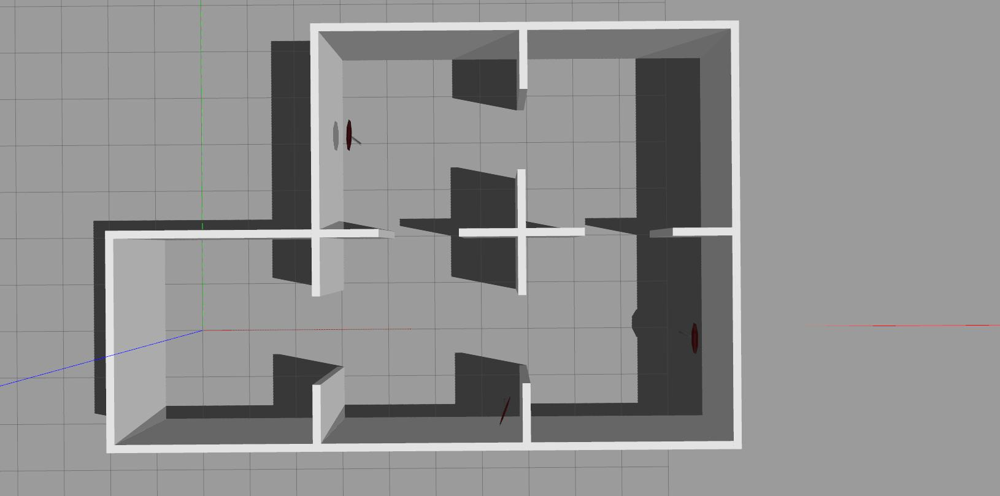

### Acknowledgement

This work was done collaborating with <a href="https://github.com/ortslil64" target="_blank">Or Tslil</a>  and <a href="https://github.com/TalFeiner" target="_blank">Tal Feiner</a>, please follow their works.

# sparse_slam

ROS implementation of online semantic SLAM. Used for large unkown indoor environments.
Object detector node is based on yolo and forked from https://github.com/zzh8829/yolov3-tf2
Line extration node is forked from https://github.com/bguplp/laser_line_extraction.git


## Video example
[](https://youtu.be/PFMEy0mtcB0)

### The world:



## Dependencies

- Python version > 3.5
- TensorFlow 2.* (GPU version)
- numpy
- pandas
- openCV
- pip3 install
- hector_mapping <a href="http://wiki.ros.org/hector_mapping" target="_blank">http://wiki.ros.org/hector_mapping</a> 
- yolov3-tf2 <a href="https://github.com/zzh8829/yolov3-tf2" target="_blank">https://github.com/zzh8829/yolov3-tf2</a>
- laser_line_extraction <a href="https://github.com/bguplp/laser_line_extraction.git" target="_blank">https://github.com/bguplp/laser_line_extraction.git</a>
- depthimage_to_laserscan http://www.ros.org/wiki/depthimage_to_laserscan
- gazebo_models_worlds_collection https://github.com/chaolmu/gazebo_models_worlds_collection.git
- robot_description https://github.com/TalFeiner/robot_description

## Setup

1. Copy, install and make the repository:
```sh
$ cd ~/your_catkin_worspace/src
$ git clone https://github.com/elbazam/sparse_slam.git
$ cd sparse_slam
$ pip3 install -e ./object_detector
$ pip3 install -e ./exits_detector
$ pip3 install -e ./room_slam
$ cd ..
$ catkin_make
```

2. Execute .sh file:
```sh
$ cd ~/your_catkin_worspace/src
$ https://github.com/TalFeiner/robot_description
$ cd ..
$ catkin_make
$ cd src/robot_description
$ chmod +x ./python3_alongside_python2.sh
$ ./python3_alongside_python2.sh
```


3. Replace the following contents:
- In <your_workspace_name>/src/sparse_slam/object_detector/object_detector/ros/object_localizer_node.py , line 89, replace the written path to your path:
- self.real_path = '/home/<Computer_name/<your_workspace_name>/src/yolov3-tf2>'

- Go to the xarco file ~/robot_description/blattoidea/urdf/kinect.xarco
- Change the orientation of the kinect to 0 0 0 from 0 0.3 0

## Execution

### Comparison to hector slam algorithm

Create files:
```sh
$ cd
$ mkdir '/home/melodic/data'
$ mkdir '/home/melodic/data/complex_sslam_data'
$ mkdir '/home/melodic/data/complex_hector_data'
$ mkdir '/home/melodic/data/complex_sslam_dt'
$ mkdir '/home/melodic/data/complex_hector_dt'
```
- Big environment:
```sh
roslaunch agent big_test.launch
```
- Small environment (the example above):
```sh
roslaunch agent Test.launch
```
### Exectution of only room slam:

```sh
$ rosrun room_slam sslam_node.py
```

## Pipelines

- Each package has its own Pipeline readme

