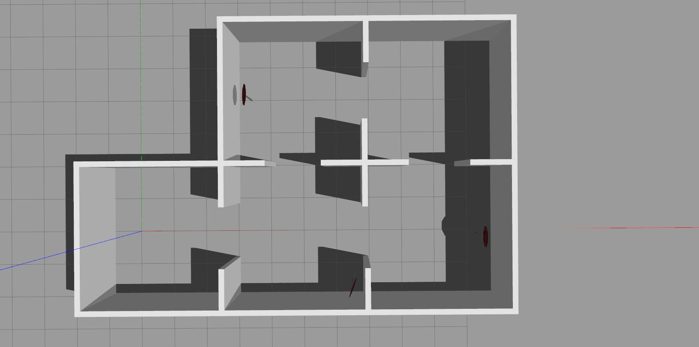

# README #


Part of RoomSLAM project. Gazebo environments. 


## Dependencies

- Gazebo 9.0
- Tested in ROS melodic, Ubuntu 18.04
- gazebo_models_worlds_collection repository
- robot_description repository

### For RoomSLAM project:
- hector SLAM repository
- depthimage_to_laserscan repository

## Setup

1. gazebo_models_worlds_collection repository:
```sh
$ cd ~/your_catkin_worspace/src
$ git clone https://github.com/chaolmu/gazebo_models_worlds_collection.git
$ cd ..
$ catkin_make
```
2. robot_description repository:
```sh
$ cd ~/your_catkin_worspace/src
$ https://github.com/TalFeiner/robot_description
$ cd ..
$ catkin_make
$ roscd robot_description
$ chmod +x src/robot_description/python3_alongside_python2.sh
$ src/robot_description/python3_alongside_python2.sh
```
3. hector slam repository:
```sh
$ cd ~/your_catkin_worspace/src
$ git clone https://github.com/tu-darmstadt-ros-pkg/hector_slam/tree/melodic-devel
$ cd ..
$ catkin_make
```
4. depthimage_to_laserscan repository:
```sh
$ cd ~/your_catkin_worspace/src
$ git clone http://www.ros.org/wiki/depthimage_to_laserscan
$ cd ..
$ catkin_make
```

5. agent repository:
```sh
$ cd ~/your_catkin_worspace/src
$ git clone https://elbazam@bitbucket.org/elbazam/agent.git
$ cd ..
$ catkin_make
```

## Changes
- Go to the xarco file robot_description/blattoidea/urdf/kinect.xarco
- Change the orientation of the kinect to 0 0 0 from 0 0.3 0


## The World

