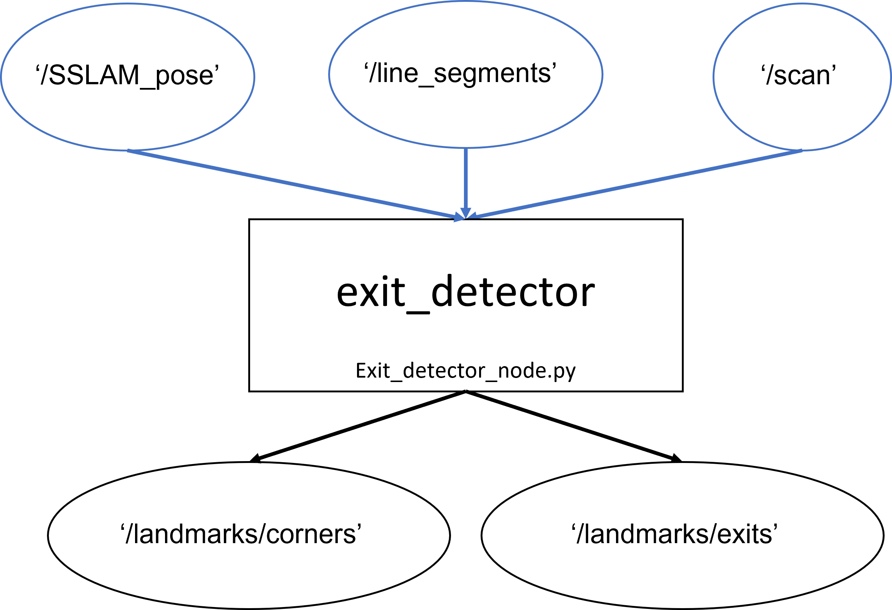

# README #


### What is this repository for? ###

Finding exits and corners using line extraction code.


### How do I get set up? ###

This is a python > 3.5 package.  
#### Requirements:  
- numpy  
- scipy  
- cv2  
- matplotlib
- pip3 install
- laser_line_extraction package:
```bash
$ cd /your-working-ros-space/src
$ git clone https://github.com/bguplp/laser_line_extraction.git
$ cd ..
$ catkin_make
```

This package integreting with the agent package.

#### Install

```bash
$ cd /your-working-ros-space/src
$ pip3 install -3 ./exits_detector
```

#### Topics flowchart:

