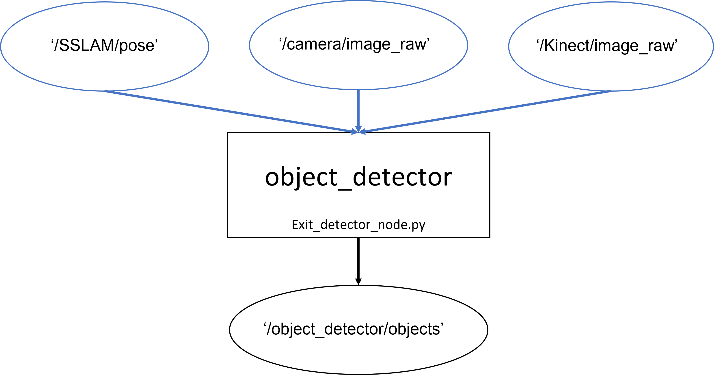

# README #


### What is this repository for? ###

Object localization.

### How do I get set up? ###

* Install package https://github.com/zzh8829/yolov3-tf2
* Replace the content of yolov3-tf2/yolov3-tf2/models.py with object_detector/add_to_yolo/yolov3-tf2/models.py
* Add the tools from object_detector/add_to_yolo to yolov3-tf2/tools
* Merge checkpoints folder object_detector/add_to_yolo/checkpoints with yolov3-tf2/checkpoints

### Correct path ###

- In object_detector/object_detector/ros/object_localizer_node.py , line 89, replace the path to your path.
- self.real_path = '/home/<Computer_name/<your_workspace_name/src/yolov3-tf2>'
- for example: 
* Computer name: Me. 
* Catkin_workspace_folder: catkin_ws.
* The path should be: '/home/Me/catkin_ws/src/yolov3-tf2'


### Install ###

```bash
$ cd ~/<your_catkin_working_space>/src
$ pip3 install -e ./object_detector
```

#### Topics flowchart

