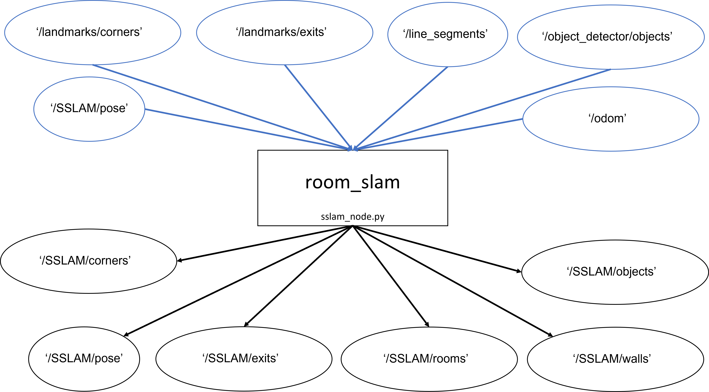

## Topics flowchart

### Topics ###

#### Publishers
##### visualization_msgs.MarkerArray:

- '/SSLAM/objects' - objects visualization.
- '/SSLAM/rooms' - rooms visualization

##### visualization_msgs.Marker:

- '/SSLAM/corners' - Corner visualization
- '/SSLAM/exits' - Exit visualization
- '/SSLAM/walls' - walls visualization

#### geometry_msgs.PoseStamped

- '/SSLAM/pose' estimated agent's pose.

#### nav.msgs.Path

- '/SSLAM/path_history' - path topic with the estimated path documented
- '/SSLAM/real_path_history' - path topic with the real path documented
- '/hector/path_history' - path topic with the hector_slam estimated path documented

#### std_msgs.Int16

- '/Exp_index' - Number of experiment for comparison.

#### Subscribers
##### object_msgs.ObjectArray

- '/object_detector/objects' - list of located objects

##### object_msgs.LandmarkArray

- '/landmarks/corners' - list of located coreners

##### object_msgs.ExitLineArray

- '/landmarks/exits' - list of located exits

##### laser_line_extraction.LineSegmentList

- '/line_segments' - list of located walls

##### nav_msgs.Odometry

- '/odom' - encoder information.

##### geometry_msgs.PoseWithCovarianceStamped

- /initialpose - initial pose
